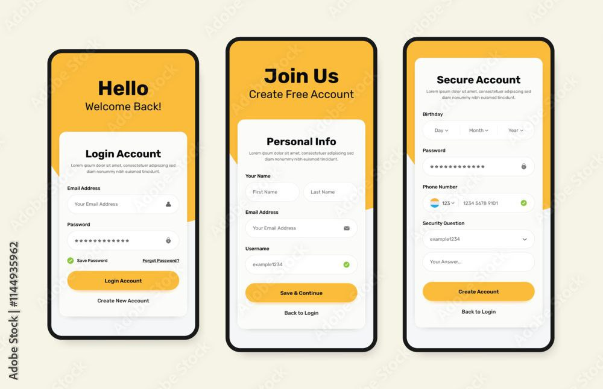
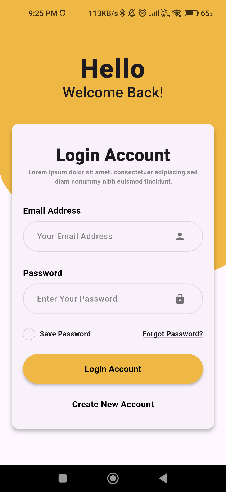
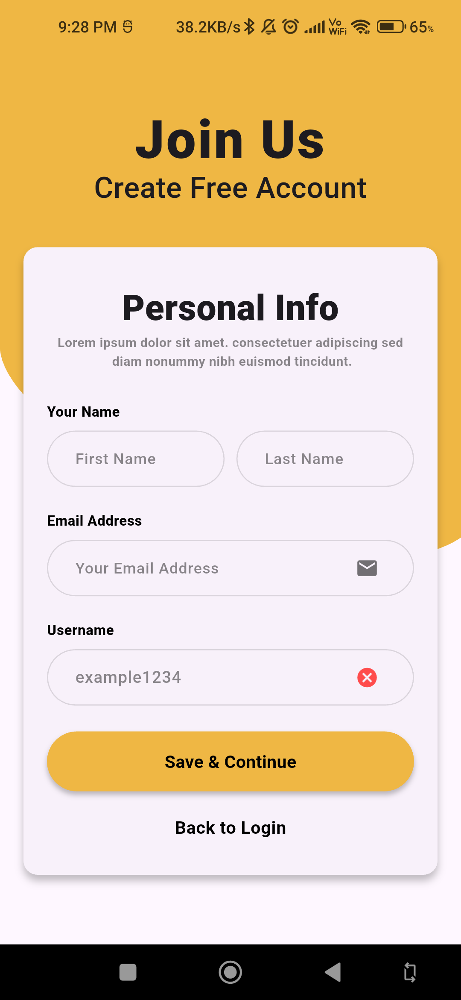
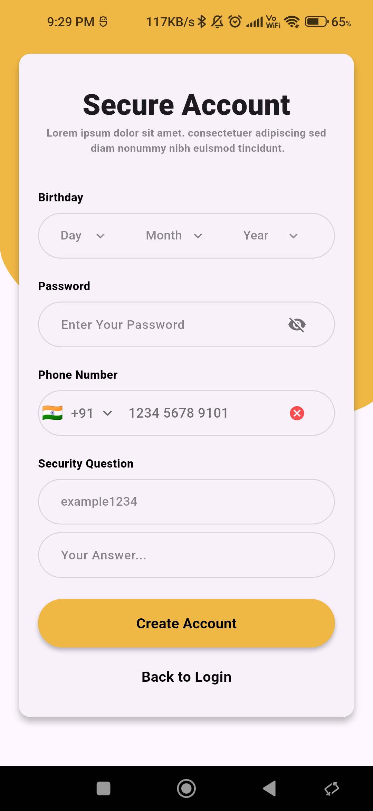
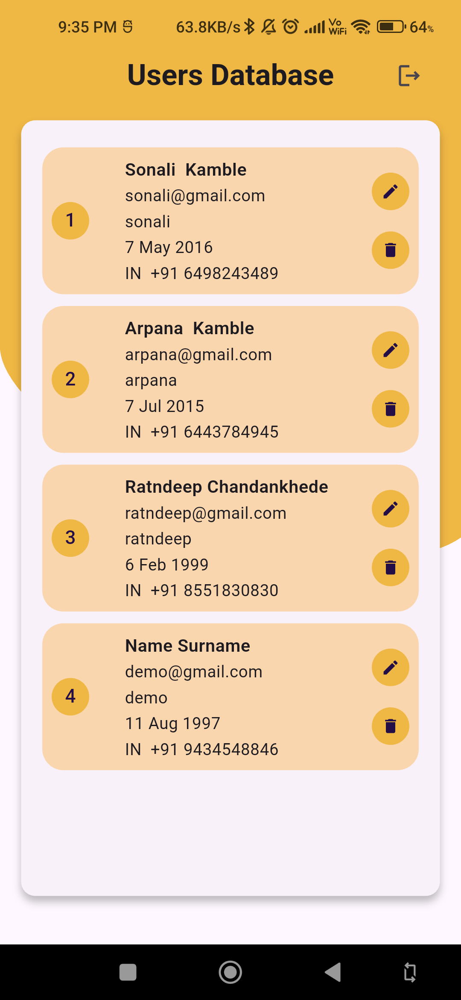
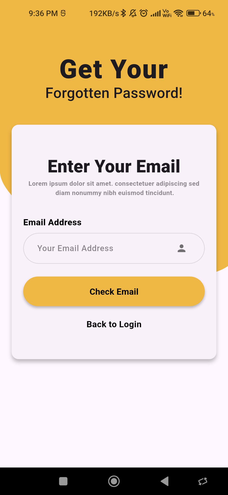
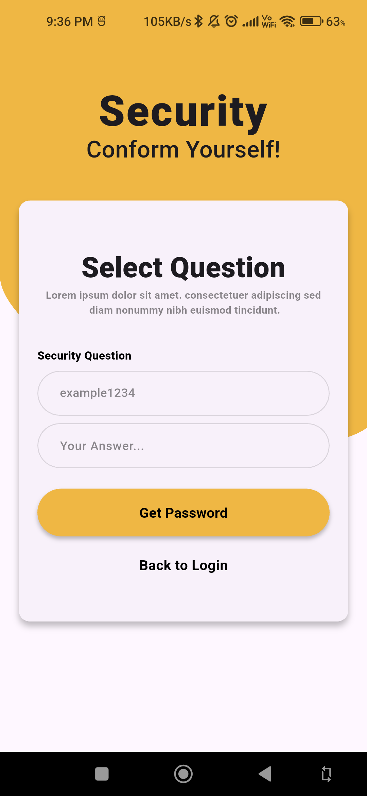

# signin_and_signup_screens

Simple signin and signup screens with custom design

## Getting Started

This project is a starting point for a Flutter application.

A few resources to get you started if this is your first Flutter project:

- [Lab: Write your first Flutter app](https://docs.flutter.dev/get-started/codelab)
- [Cookbook: Useful Flutter samples](https://docs.flutter.dev/cookbook)

For help getting started with Flutter development, view the
[online documentation](https://docs.flutter.dev/), which offers tutorials,
samples, guidance on mobile development, and a full API reference.

# RAW DESIGN

# Splash Screen

# Signing Page

# Signup First Page

# Signup Second Page

# Dashboard Page

# FORGET PASSWORD PAGES

# Forget Password Page

# Secure User Page

# Show Password Page
