# signin_and_signup_screens

Simple signin and signup screens with custom design

## Getting Started

This project is a starting point for a Flutter application.

A few resources to get you started if this is your first Flutter project:

- [Lab: Write your first Flutter app](https://docs.flutter.dev/get-started/codelab)
- [Cookbook: Useful Flutter samples](https://docs.flutter.dev/cookbook)

For help getting started with Flutter development, view the
[online documentation](https://docs.flutter.dev/), which offers tutorials,
samples, guidance on mobile development, and a full API reference.

# 1) Splash Screen
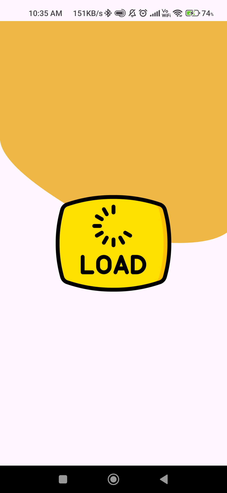

# 2) Signing Screen
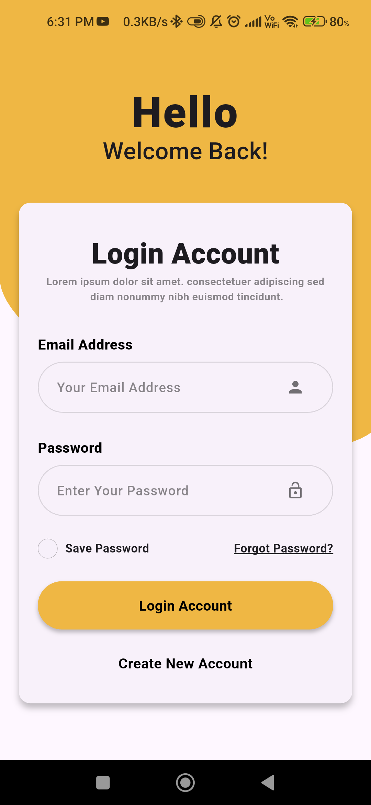

# 3) Signing Screen With Validation
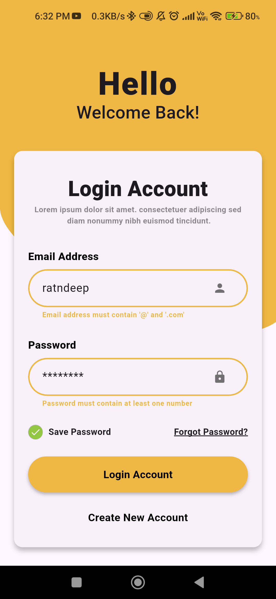

# 4) Signup First Screen
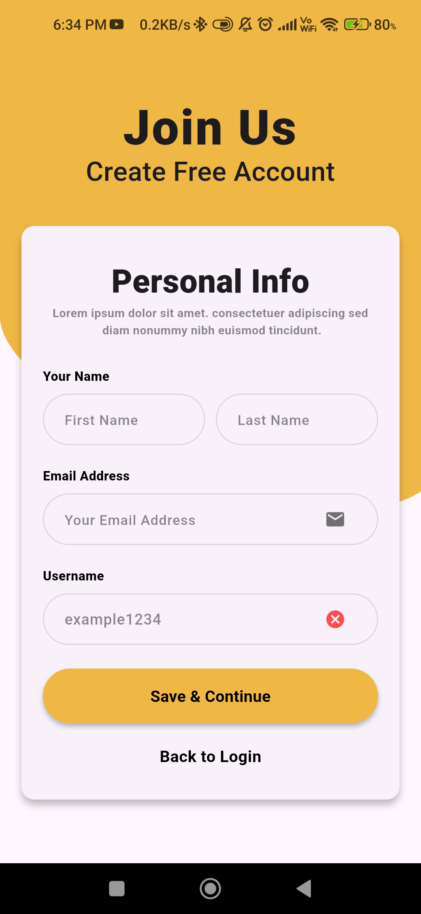

# 5) Signup First Screen With Validation
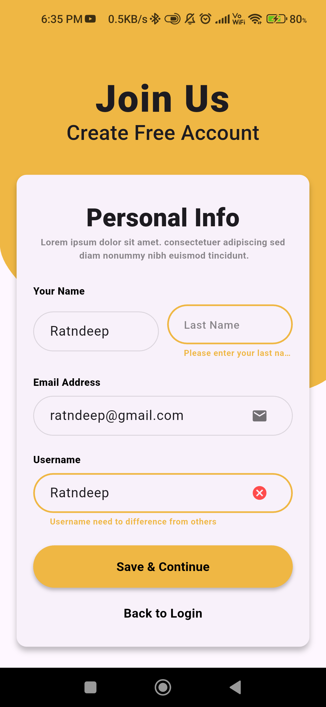

# 6) Signup Second Screen
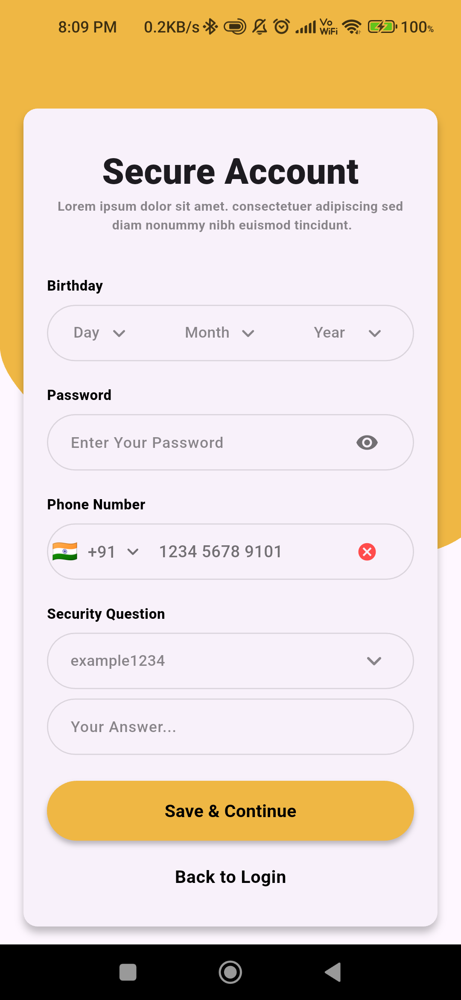

# 7) Signup Second Screen With Validation
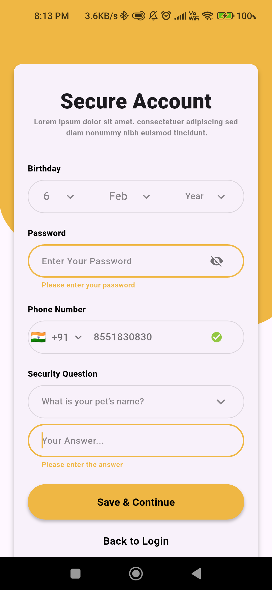

# 8) Home Screen
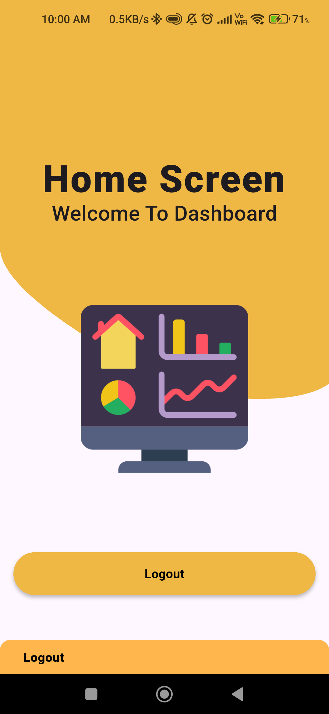

# 9) Validate Email Screen (Forget Password Section)
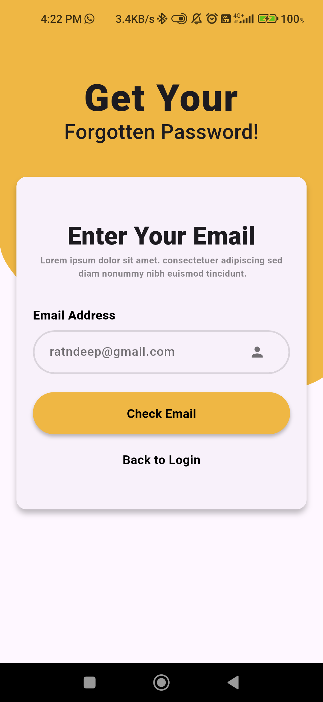

# 10) Validate Answer Screen (Forget Password Section)
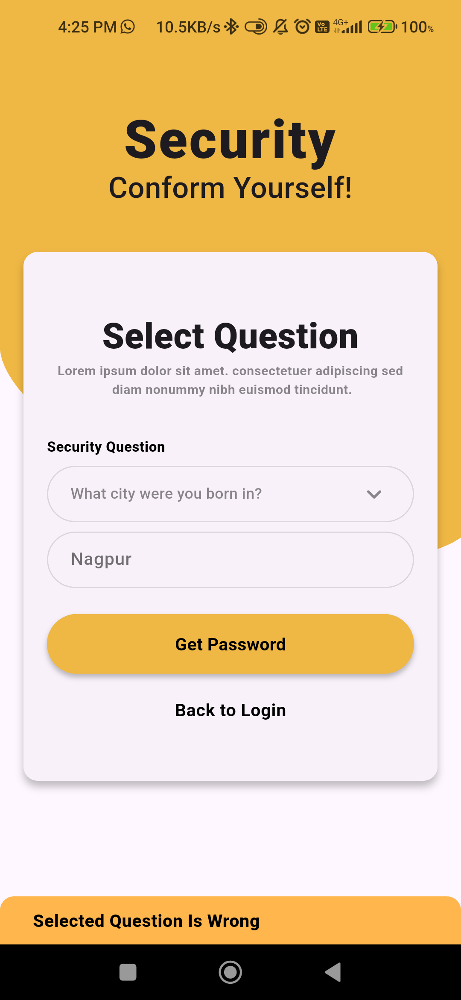

# 11) Show Password Screen Screen (Forget Password Section)
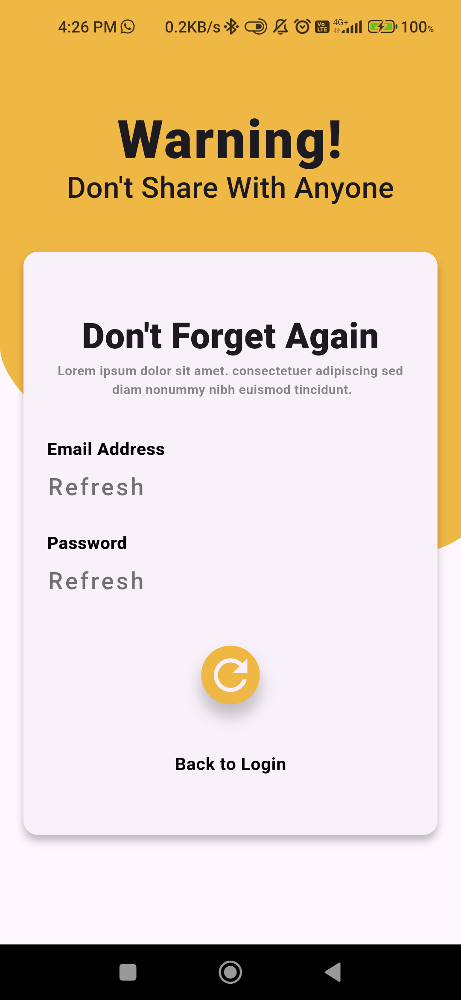

# 12) Shown Forgotten Details Screen (Forget Password Section)
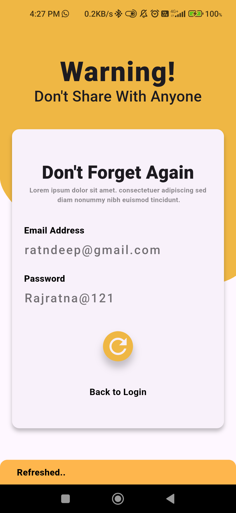